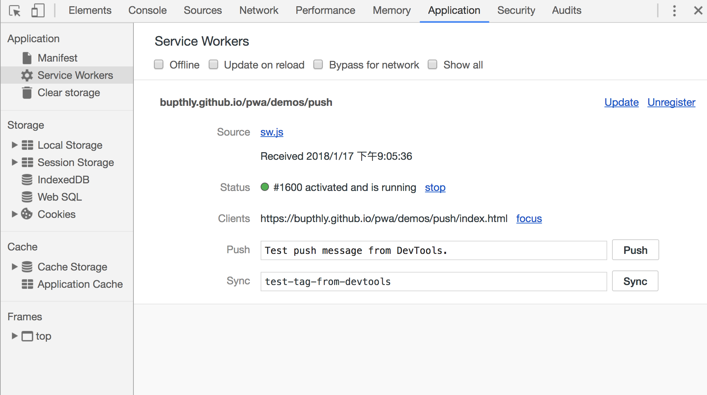
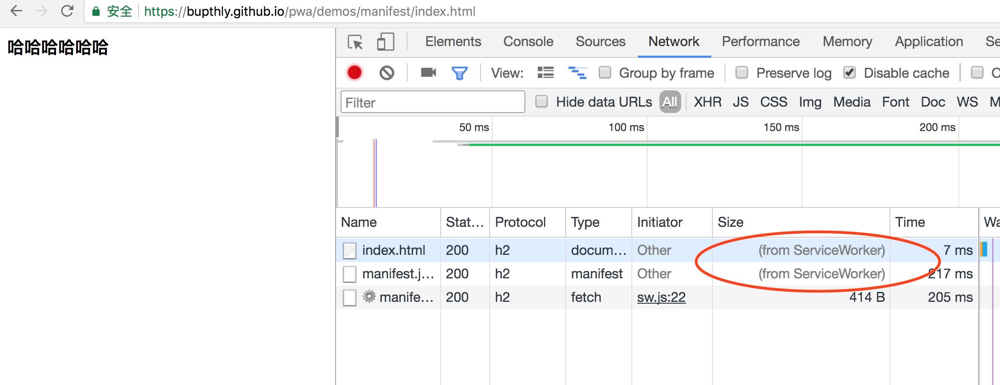
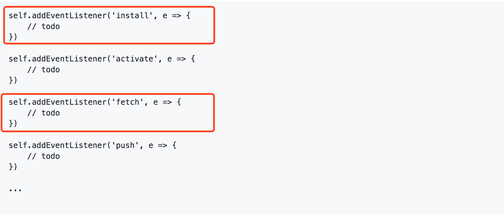
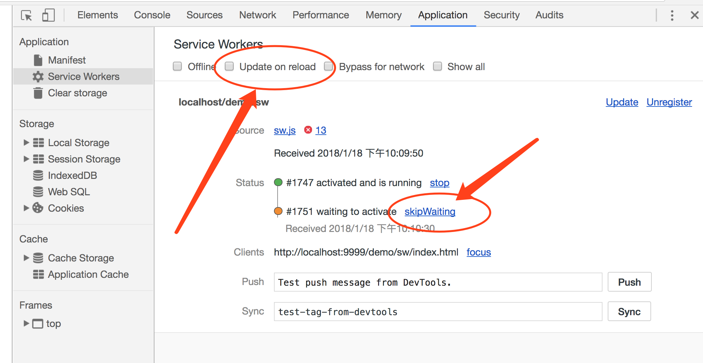
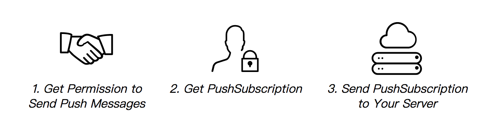
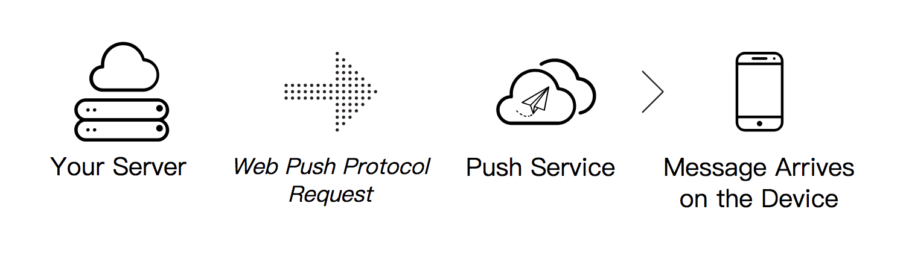
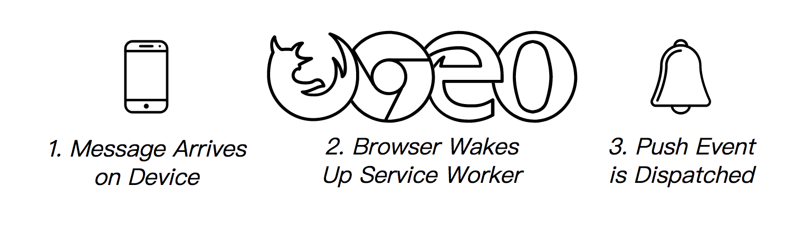
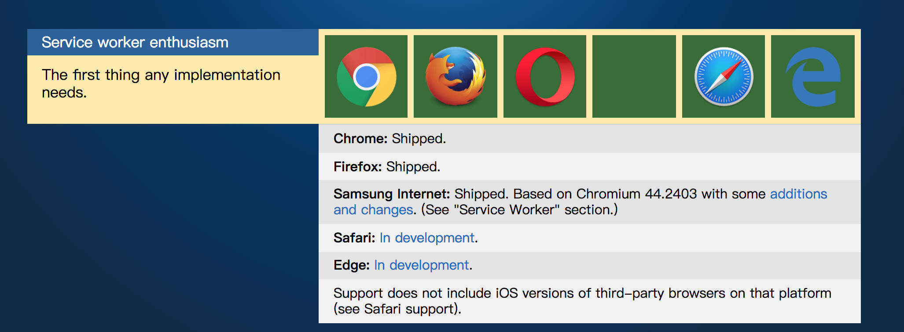

# 什么是pwa

Progressive Web App, 简称 PWA，是提升 Web App 的体验的一种新方法，能给用户原生应用的体验，在安全、性能和体验三个方面都有很大的提升，即：

- 可靠 - 即使在不稳定的网络环境下，也能瞬间加载并展现
- 体验 - 快速响应，并且有平滑的动画响应用户的操作
- 粘性 - 像设备上的原生应用，具有沉浸式的用户体验，用户可以添加到桌面

# pwa特性

- 离线缓存
- 推送通知（push notifications）
- 添加主屏

以上三种特性都基于service worker技术实现，因此，在介绍这三个特性之前，我们先来了解一下service worker。

## service worker

### 概述

service worker是一个注册在指定源和路径下的事件驱动worker，运行在浏览器后台线程。它旨在创建更好的离线体验。

Service workers 本质上充当Web应用程序与浏览器之间的代理服务器，也可以在网络可用时作为浏览器和网络间的代理，它采用JavaScript控制关联的页面或者网站，拦截并修改访问和资源请求，细粒度地缓存资源，可以是开发者能够控制应用在无网情况下的表现。另外，service worker还允许访问推送通知和后台同步API。

Service worker运行在worker上下文，因此它不能访问DOM。相对于驱动应用的主JavaScript线程，它运行在其他线程中，所以不会造成阻塞。它设计为完全异步，同步API（如XHR和localStorage）不能在service worker中使用。



### 功能
- 缓存文件和数据
- 网络代理，拦截和处理网络请求
- 允许推送通知



### 依赖
- https
由于service worker可以对网络请求进行拦截、改写等操作，出于安全考量，Service workers只能由HTTPS承载。
- browser

### 生命周期

- 下载（download）
- 安装（install）
- 激活（activate）

关于生命周期会在离线缓存部分进行详细说明

### 其他说明

- service worker中大部分场景是等待响应的结果，然后再进行下一步操作，因此大量使用了Promise。为了更好地理解service worker，需要先对promise有一定了解。

- 在service worker之前，也有一些其他的解决离线缓存的技术方案，比如AppCache，但是其他方案都存在一些问题，而service worker则在设计上避免了这些问题。

## 离线缓存

离线缓存，是指当用户访问页面时，我们可以控制将一些资源缓存到本地；这样，当用户处于弱网或无网状态时，就可以访问之前的缓存，提升用户体验。主要是两点：

- 缓存资源；
- 处理网络请求；

上文提到，sw生命周期中包含下载、安装、激活三个阶段。在使用service worker前，需要先进行注册，使用register方法。当在页面中注册一个sw时，会立即下载该sw文件。注册成功后，可以拿到一个ServiceWorkerRegistration对象，该对象包含sw的相关信息，包括所属的域等。

```
if ('serviceWorker' in navigator) {
    window.addEventListener('load', function() {
        navigator.serviceWorker.register('/sw.js').then(function(registration) {
            // Registration was successful
            console.log('ServiceWorker registration successful with scope: ', registration.scope);
        }, function(err) {
            // registration failed :(
            console.log('ServiceWorker registration failed: ', err);
        });
    });
}
```

这个代码注册了一个service worker。在service worker内部，我们可以对一些事件进行监听，包括servcie worker生命周期、网络请求、push通知等。



如上图所示，实现离线缓存主要是对install和fetch两个事件的监听。

sw文件下载完成后，会触发sw的install事件，通常情况下，我们会在install事件中做一些针对静态资源文件的缓存处理。通过监听fetch事件，对于每个请求，可以返回缓存中的数据，或者从服务器拉取最新的数据并返回。

举个🌰：

```
var cacheVersion = 'cache-v1';

var cacheList = ['index.html'];

self.addEventListener('install', e => {
    e.waitUntil(
        caches.open(cacheVersion)
        .then(cache => cache.addAll(cacheList)) //将指定的文件添加到缓存中
        .then(() => self.skipWaiting())
    )
})

self.addEventListener('activate', function(e) {
    console.log('activate');
})

self.addEventListener('fetch', function(e) {
    e.respondWith(
        caches.match(e.request).then(function(response) { //从缓存中读取数据并返回
            if (response != null) {
                return response
            }
            return fetch(e.request.url)
        })
    )
})
```

从这个例子中可以看到，在sw的受控页面中，当页面请求加载index.html文件时，service worker拦截到了该请求，并从cache中读取数据作为结果返回。

**首次请求和二次请求**

首次加载的页面，还不会受service worker的控制；只有二次加载的页面，才会被控制

demo

3）一次只能运行一个版本，如何保证，什么机制（在开发时会导致一些问题，通过devTools解决）

这样会造成一个问题：假如我们更新了index.html文件，用户看到的却还是之前的。

数据更新了怎么处理？


### service worker更新机制

### 开发与调试利器

- 开发者工具



- 监控

chrome://inspect/#service-workers

### 问题：

- websocket & webrtc 如何处理

既然我们可以对文件进行缓存，那也就必然面临缓存失效的问题，更新被service worker缓存的静态文件，必须通过更新service worker的方法来解决。

    - 生命周期
        service worker的生命周期与网页的生命周期完全不同，它是执行在浏览器层级的，由浏览器在后台运行。
        安装service worker需要先进行注册

        在install阶段，可以缓存一些静态资源。如果所有的静态资源都缓存成功，service worker就会install成功。如果有任意一个文件没能下载或者缓存成功，install就不会成功

        install完成后，会触发activition，在activation步骤我们可以管理旧的缓存

    - 注册       
        1) service worker 作用域
        2）chrome://inspect/#service-workers 监控
    
    - 安装

    var CACHE_NAME = 'my-site-cache-v1';
    var urlsToCache = [
        '/',
        '/styles/main.css',
        '/script/main.js'
    ];

    self.addEventListener('install', function(event) {
        // Perform install steps
        event.waitUntil(
            caches.open(CACHE_NAME)
            .then(function(cache) {
                console.log('Opened cache');
                return cache.addAll(urlsToCache);
            })
        );
    });

- 关闭浏览器后是否仍然可以运行

## 推送通知（push notifications）

### push的工作机制

#### step1

- 获取用户对于notification的授权
- 拿到设备的ID，用于区分不同设备（PushSubscription）
- 把这个信息发送给服务器

简单来说就是，客户端同意接受来自服务器的推送，然后告诉服务器自己是谁。如下图所示：



#### step2

当服务器端获取到设备的ID后，就可以向其推送消息。服务器需要向push service发请求，告知push service希望将数据推送给谁，推送什么数据等信息。

简单介绍一下push service：

push service会接收网络请求，并对其进行校验，校验通过后，会给指定的浏览器推送一条消息。如果该浏览器是离线状态，这条消息会被存起来知道浏览器在线，再发送给浏览器。对于我们来说，无需关心到底使用的什么push service，只要保证按照协议[web push protocol](https://tools.ietf.org/html/draft-ietf-webpush-protocol-12)发起正确的请求即可。

```
{
    "endpoint": "https://fcm.googleapis.com/fcm/send/elUUKjDMaOU:APA91bHTB6-7Bi9y_tTerk1zDLJ4LM9gap-Piyx5J2xQtBhpKrhNQueBq_-aA6KoH_-b0kWqR89Kthv_cZFGFJKkP47hq3b3MREqCLEth6WyhFljT4i206SIm60uBC20xpxj-C4xE-cf",
    "expirationTime": null,
    "keys": {
        "p256dh": "BHMdMIHjLgkExjjiRlNYm5LLvS5_iVFJm9D-8-UKkoN3d8eo2vYOaQxhBHV_njD-M6zNr4davOffk5z63RiDy9Y=",
        "auth": "JjwOuSFX5K051OCJSz2Igw=="
    }
}
```

如上是一个PushSubscription的详细数据，其中endpoint是该浏览器所用的push service的地址。



#### step3

当浏览器收到来自push service的消息后，会唤起service worker，service worker监听到push事件，拿到推送的数据，并提示给用户。如图所示：


    
### 具体实现及demo演示

```
function subscribeUserToPush() {
    return navigator.serviceWorker.register('service-worker.js')
    .then(function(registration) {
        const subscribeOptions = {
            userVisibleOnly: true,
            applicationServerKey: urlBase64ToUint8Array(
            'BEl62iUYgUivxIkv69yViEuiBIa-Ib9-SkvMeAtA3LFgDzkrxZJjSgSnfckjBJuBkr3qBUYIHBQFLXYp5Nksh8U')
        };

        return registration.pushManager.subscribe(subscribeOptions);
    })
    .then(function(pushSubscription) {
        console.log('Received PushSubscription: ', JSON.stringify(pushSubscription));
        return pushSubscription;
    });
}
```

```
self.addEventListener('push', function(e) {
    if (e.data) {
        console.log('This push event has data: ', e.data.text());
    } else {
        console.log('This push event has no data.');
    }
})
```

demo

## 添加主屏

### manifest.json简介：

manifest文件中定义了应用的名称，显示方式，开屏背景色，主题色，应用图标等信息

```
{
    "name": "Minimal app to try PWA",
    "short_name": "Minimal PWA",
    "display": "standalone",
    "start_url": "/pwa/demos/manifest/index.html",
    "theme_color": "#8888ff",
    "background_color": "#aaaaff",
    "icons": [
        {
            "src": "logo-36.png",
            "sizes": "36x36",
            "type": "image/png"
        },
        {
            "src": "logo-48.png",
            "sizes": "48x48",
            "type": "image/png"
        },
        {
            "src": "logo-72.png",
            "sizes": "72x72",
            "type": "image/png"
        },
        {
            "src": "logo-96.png",
            "sizes": "96x96",
            "type": "image/png"
        },
        {
            "src": "logo-144.png",
            "sizes": "144x144",
            "type": "image/png"
        },
        {
            "src": "logo-192.png",
            "sizes": "192x192",
            "type": "image/png"
        }
    ]
}
```

**说明:**

- name：开屏效果上显示的名字
- short_name：保存到主屏幕上时显示的名字
- display：展示方式，全屏还是普通浏览器方式
- theme_color: 主题颜色
- background_color：开屏背景色
- icons

将图标保存到主屏幕时，Chrome 首先寻找与显示密度匹配并且尺寸调整到 48dp 屏幕密度的图标。如果未找到任何图标，则会查找与设备特性匹配度最高的图标。无论出于任何原因，如果您想把目标明确锁定在具有特定像素密度的图标，可以使用带数字参数的可选 density 成员。如果您不声明密度，其默认值为 1.0。这意味着“可将该图标用于等于和大于 1.0 的屏幕密度”，而这通常就是您所需要的。

**注意**

在添加到主屏时，会检测是否注册了service worker，以及service worker是否做了离线缓存的处理，即是否监听了fetch事件。因此，service worker是使用添加主屏功能的前提条件。

demo演示

# 兼容性



更细节的支持可以在[Is Service Worker Ready](https://jakearchibald.github.io/isserviceworkerready/#service-worker-enthusiasm)查看

# 业界观点

目前，业界对于pwa的看法主要分为两派：

# 参考资料


